# Resume Builder

**Resumes as code.** A developer-focused resume builder built around structured JSON, reusable React components, and theme-driven rendering — like shadcn/ui for resumes.

```
JSON → Schema → Renderer → Theme → HTML / PDF / Print
```

No drag & drop. No WYSIWYG. No backend. Your resume is data; components render it; themes style it; PDF and HTML are just output formats.

## Quick start

```bash
npm install
npm run dev
```

Open the app, edit the JSON on the left, watch the preview update instantly. Use your own resume with `RESUME_FILE=data/me.json npm run dev` (the `data/` folder is git-ignored). The header has a light/dark toggle for the app UI, and the right-hand sidebar switches themes live (arrow keys, or `[` / `]`). Pick a theme, pick a paper size, click **Download PDF**.

> **Using an AI agent?** See [`AGENTS.md`](AGENTS.md) — a step-by-step guide for creating a resume with this project.

## Why this architecture

- **ATS & AI-parser friendly** — semantic HTML (`h1`, `h2`, `ul`), real vector text in PDFs, no rasterization, no tables-for-layout.
- **Pixel-perfect PDF** — print-first via `react-to-print`; the browser's print engine produces selectable, searchable text. What you preview is what you export.
- **Theme switching never touches data** — themes are design tokens + component overrides. Swapping themes re-renders the same JSON.
- **New themes need zero renderer changes** — the renderer only knows the `ThemeComponents` contract.

## Monorepo layout

| Package | Purpose |
| --- | --- |
| `packages/schema` | Zod schema, TypeScript types, `validateResume`, section ordering, JSON Schema generator |
| `packages/ui` | Theme contract (`Theme`, `DesignTokens`), typed section components, base CSS |
| `packages/renderer` | `<ResumeRenderer data={...} theme={...} />` |
| `packages/themes` | 29 themes — see [Themes](#themes) |
| `packages/pdf` | `useResumePdf` print hook, paper sizes (A4 / Letter) |
| `apps/web` | Vite + React 19 + Tailwind v4 + Zustand editor app |
| `examples/` | Example resume JSON |

## Resume JSON

Everything is optional except `basics`. See [`examples/sonu.json`](examples/sonu.json) for a complete example.

```json
{
  "basics": { "name": "Ada Lovelace", "label": "Engineer", "email": "ada@example.com" },
  "summary": "…",
  "skills": [{ "name": "Languages", "keywords": ["Go", "Python"] }],
  "experience": [{ "company": "…", "position": "…", "startDate": "2022-04", "highlights": ["…"] }]
}
```

Supported sections: `summary`, `experience`, `skills`, `projects`, `education`, `certifications`, `achievements`, `awards`, `publications`, `openSource`, `languages`, `interests`. Reorder or hide sections with `meta.sectionOrder` / `meta.hiddenSections`.

### JSON Schema

[`resume.schema.json`](resume.schema.json) describes every field (types, required keys, descriptions). Point your resume at it and editors (VS Code, JetBrains, …) give autocompletion and inline validation:

```json
{ "$schema": "./resume.schema.json", "basics": { "name": "Ada Lovelace" } }
```

The file is generated from the Zod schema, so never edit it by hand — run `npm run schema:generate` after changing `packages/schema/src/index.ts`. Dates use `"YYYY"` or `"YYYY-MM"`; omit `endDate` for a current role.

## Themes

| Kind | Themes |
| --- | --- |
| Single column | Google, Anthropic, OpenAI, Netflix, Meta, xAI |
| Two column | Atlas, Ocean (tinted right panel), Slate (dark left sidebar + monogram), Nordic (frosted left sidebar), Indigo (gradient sidebar), Coral, Parchment (serif, warm) |
| Graphical | Banner (gradient header card), Timeline (rail + dots), Sunset, Aurora (mesh gradient), Cards (each section a card), Bauhaus (geometric shapes), Brutalist (hard shadows), Blueprint (gridded title block) |
| Dark | Midnight, Terminal, Dracula, Obsidian (gold on black), Synthwave (neon), Forest, Eclipse (2-col), Twilight (2-col), Blueprint — backgrounds are printed into the PDF |

### Gallery

Every theme rendering [`examples/sonu.json`](examples/sonu.json) (screenshots are in [`screenshots/`](screenshots)).

| **Google** | **Anthropic** | **OpenAI** |
| --- | --- | --- |
| 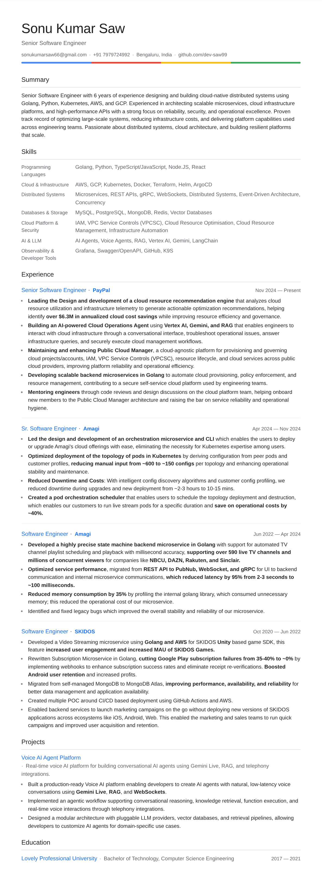 | 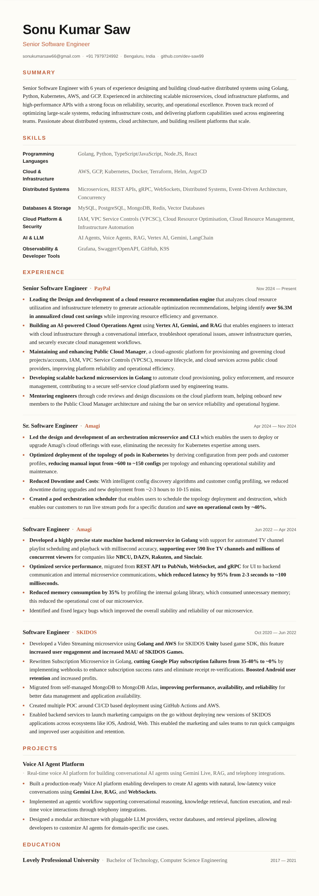 | 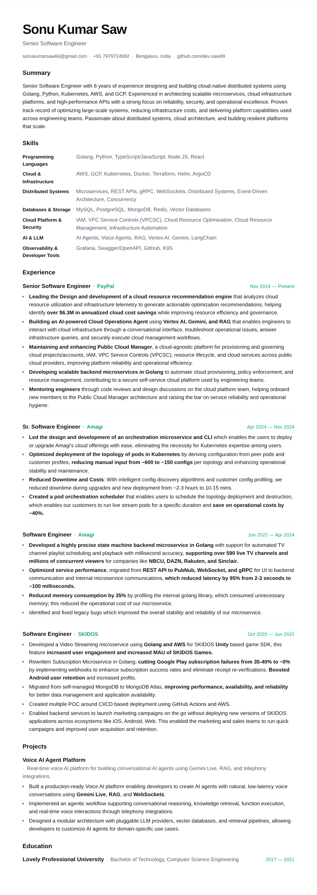 |
| **Netflix** | **Meta** | **xAI** |
| 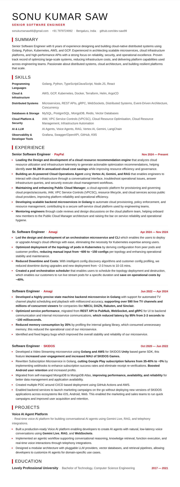 | 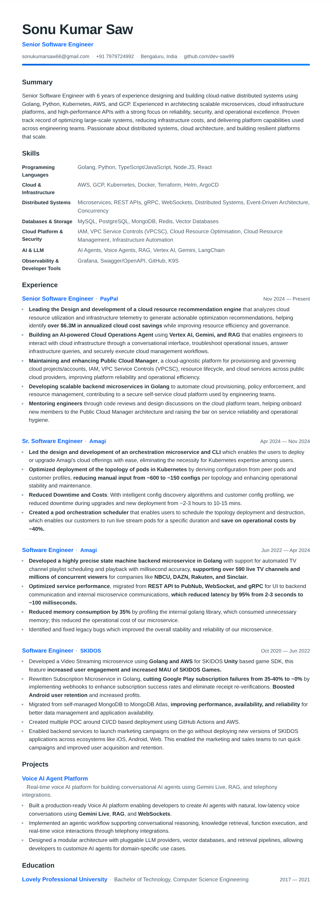 | 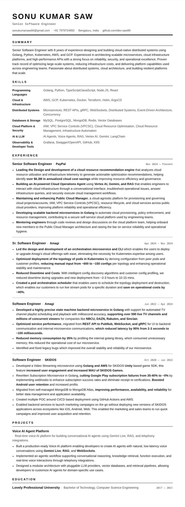 |
| **Atlas** | **Ocean** | **Slate** |
| 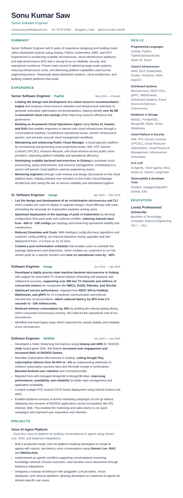 | 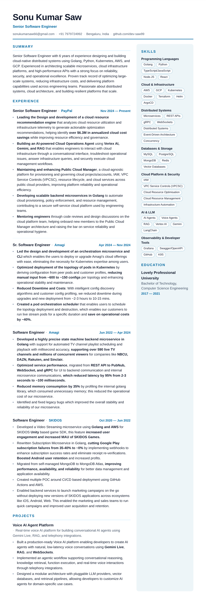 | 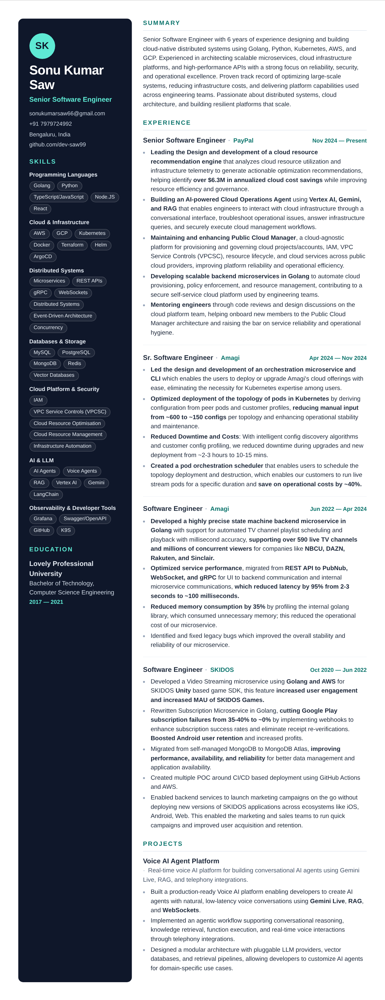 |
| **Nordic** | **Indigo** | **Coral** |
| 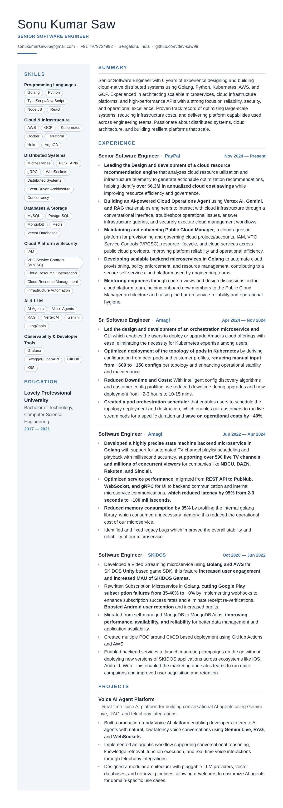 | 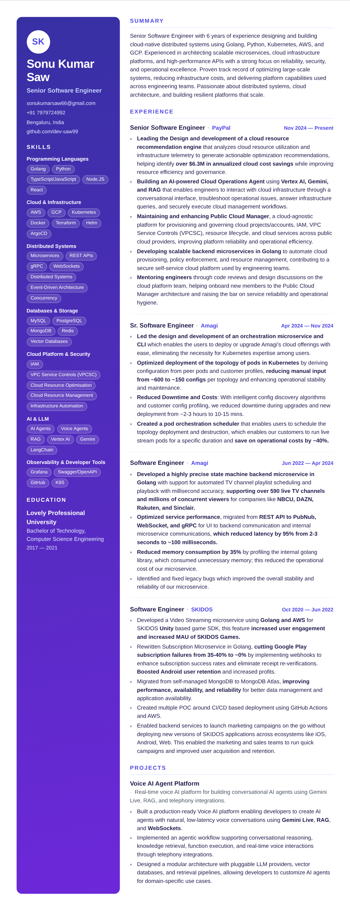 | 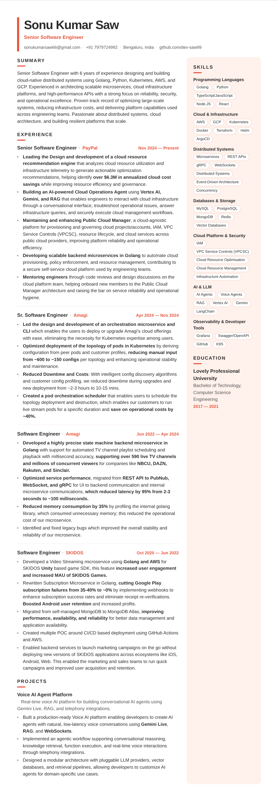 |
| **Parchment** | **Banner** | **Timeline** |
| 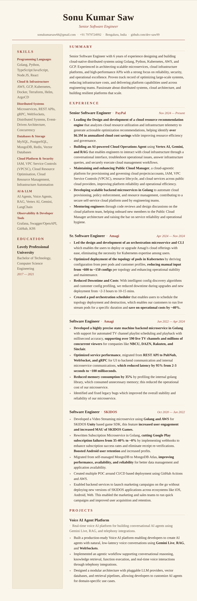 | 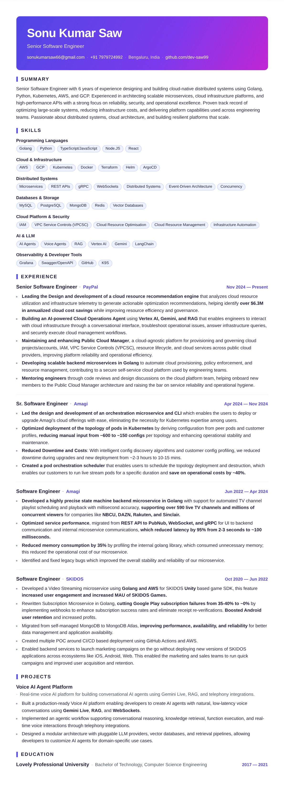 | 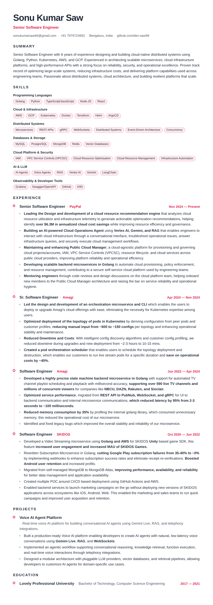 |
| **Sunset** | **Aurora** | **Cards** |
| 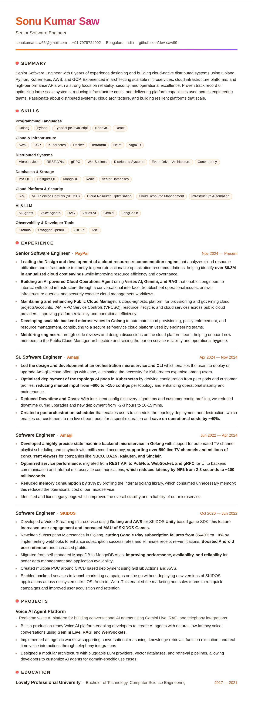 | 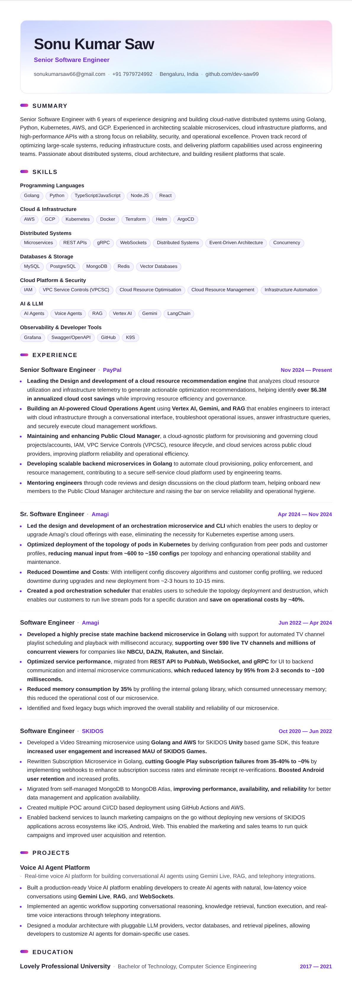 | 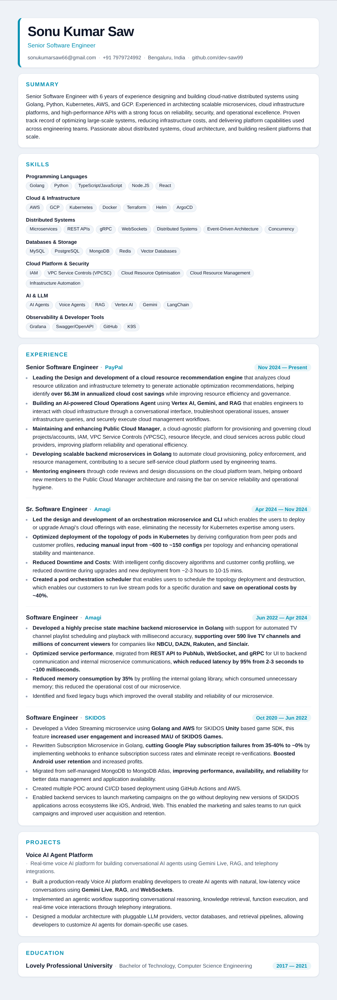 |
| **Bauhaus** | **Brutalist** | **Blueprint** |
| 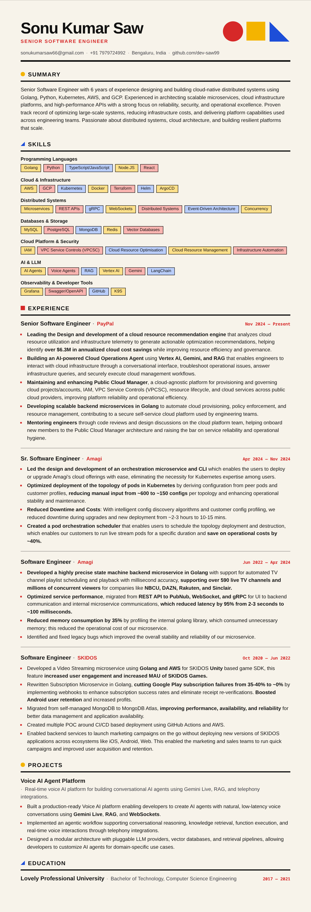 | 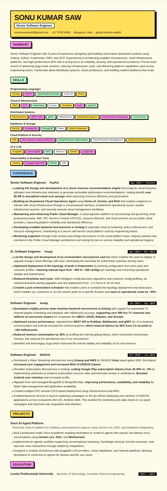 | 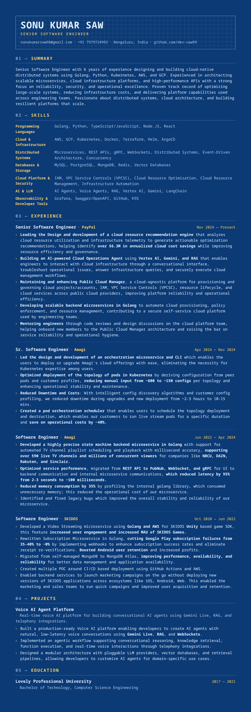 |
| **Midnight** | **Terminal** | **Dracula** |
| 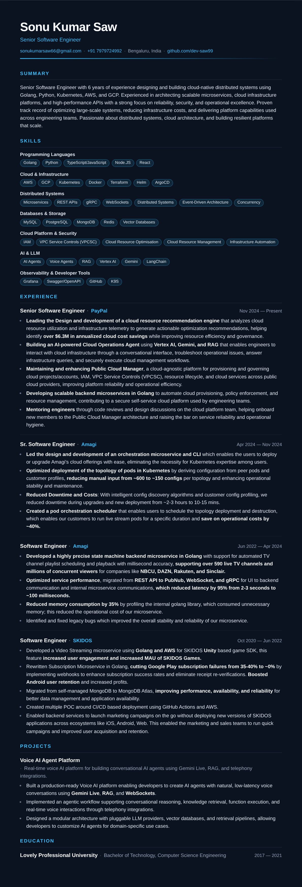 | 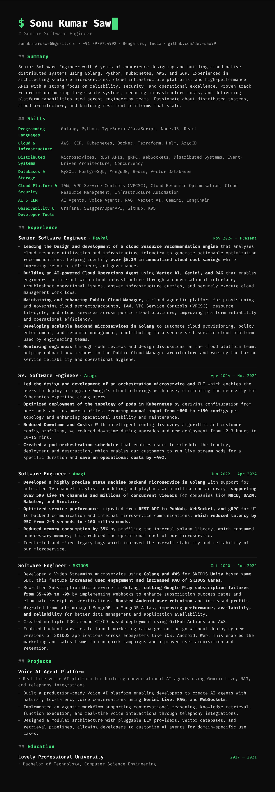 | 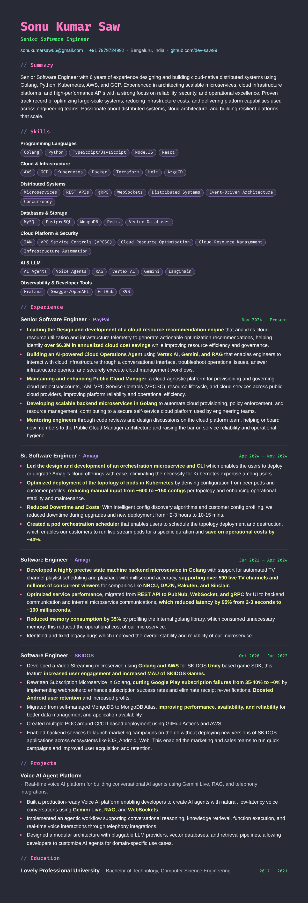 |
| **Obsidian** | **Synthwave** | **Forest** |
| 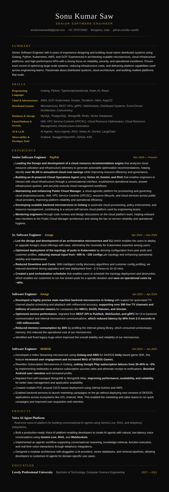 | 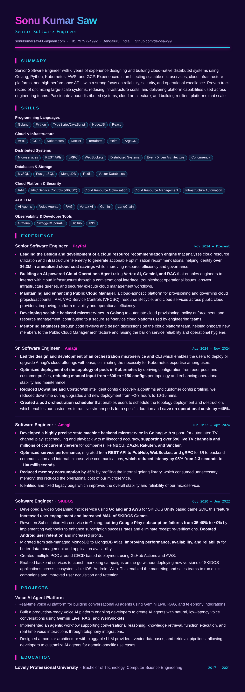 | 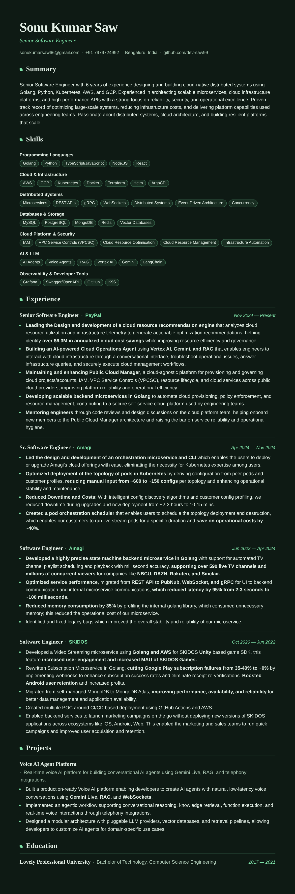 |
| **Eclipse** | **Twilight** |   |
| 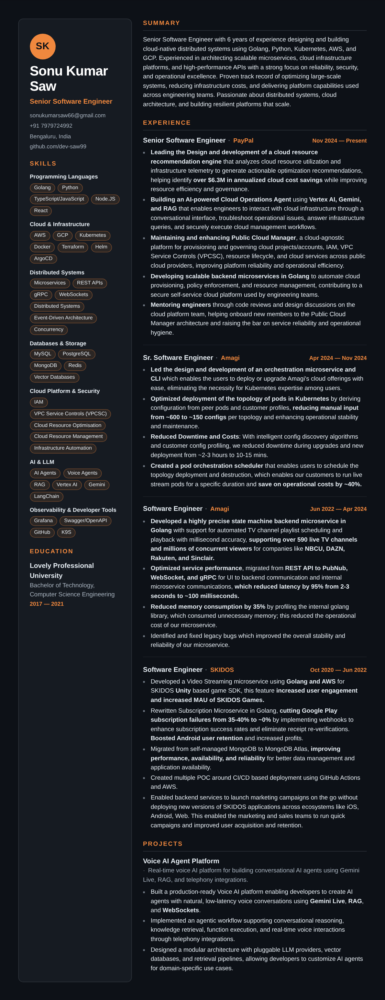 | 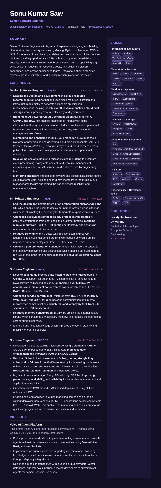 |   |

## Writing a theme

A theme is design tokens plus a full set of section components. Spread the defaults and override only what you need:

```tsx
import { defaultComponents, type Theme } from "@resume/ui";

export const myTheme: Theme = {
  id: "my-theme",
  name: "My Theme",
  className: "theme-my-theme",
  tokens: { /* colors, fonts, type scale, spacing */ },
  components: { ...defaultComponents, Header: MyHeader },
};
```

Set `sidebar` to move sections into a second column, `sidebarPosition: "left"` to put it on the left, and `headerInSidebar: true` to render the header at the top of the sidebar (see `slate.tsx`).

Tokens become `--rb-*` CSS variables on the resume root; the base stylesheet in `@resume/ui` consumes them. Themes never touch resume data.

## Scripts

```bash
npm run dev        # start the editor app
npm run build      # production build
npm run typecheck  # tsc across the whole monorepo
npm run schema:generate  # regenerate resume.schema.json from the Zod schema
npm run validate -- data/me.json  # validate a resume file from the CLI
```

## Roadmap

- [x] Phase 1 — schema, renderer, theme API, Linear theme, print/PDF, example resume
- [x] Phase 2 (partial) — Minimal & Executive themes
- [x] Phase 3 (partial) — live JSON editor, validation, theme switcher
- [x] More themes — two-column, graphical and dark layouts
- [ ] Dark mode, print preview polish
- [ ] AI: resume generation, job tailoring, cover letters, ATS scoring
- [ ] CLI: `resume dev` / `resume build` / `resume export pdf`

## License

MIT
