<div align="center">

# Resume Builder

**Resumes as code.** Write your resume once as JSON, pick from 29 themes, export a consistent PDF.<br>
Edit one line and nothing else moves.

[](LICENSE)


[The problem](#the-problem-this-solves) &nbsp;·&nbsp; [Quick start](#quick-start) &nbsp;·&nbsp; [Use with AI](#use-it-with-ai) &nbsp;·&nbsp; [Themes](#themes) &nbsp;·&nbsp; [PDF export](#exporting-a-pdf) &nbsp;·&nbsp; [Resume JSON](#the-resume-json) &nbsp;·&nbsp; [Develop](#development)

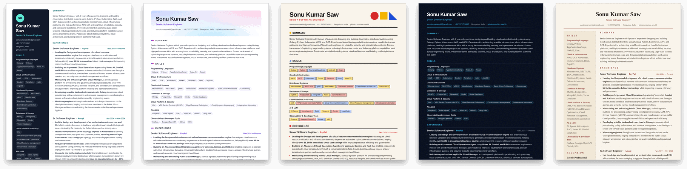

</div>

```
JSON  →  Schema  →  Renderer  →  Theme  →  HTML / PDF
```

No drag and drop, no WYSIWYG, no backend. Your resume is **data**; components render it; themes style it; PDF and HTML are just output formats.

## Highlights

| Feature | What you get |
| --- | --- |
| 🎨 **29 themes** | Single-column, two-column, graphical and dark. Switch live from a sidebar with the arrow keys. |
| 🧱 **Content is separate from design** | Your resume is a JSON file. Change a word, add a job or swap themes and the layout adapts. |
| 📄 **Its own PDF renderer** | A headless Chrome the project controls: fixed paper size, no headers or footers, real selectable text. |
| 🤖 **Built for AI** | An [`AGENTS.md`](AGENTS.md) for coding agents, copy-paste prompts for chat AIs, and a job-description tailoring workflow. |
| ✅ **Schema-validated** | A JSON Schema for editor autocompletion, a CLI validator, and inline errors that name the exact field. |
| 🌗 **Comfortable editor** | Live preview, light and dark app UI, collapsible theme sidebar, keyboard-first. |

## The problem this solves

If you have kept a resume in Word, Google Docs or a design template, you know the cycle: add one bullet and the layout jumps, a heading is stranded at the bottom of a page, a table cell blows up, and you spend an hour nudging margins and font sizes to get back to one page. Want a fresh look? Rebuild the document in a new template and re-paste everything. Applying to ten jobs? Ten files named `resume_final_v3_REAL.docx`.

The root cause is that **content and formatting live in the same file**. Here they are separate: your resume is plain data, and themes decide how it looks.

| The usual pain | What happens here |
| --- | --- |
| Edit one line and the layout breaks or shifts | You only edit text in a JSON file. The layout is generated, so everything reflows on its own: long jobs flow across pages, headers stay with their first lines, bullets never split. |
| Fiddling with margins, font sizes, tabs and spaces to fit a page | None of that is in your data. Paper size, margins, font and background are settings in the top bar, applied on top of any theme. |
| Want a different look, so rebuild the doc in a new template | Switch themes with one keystroke. Same data, no re-pasting, nothing to fix afterwards. |
| `resume_final_v3_REAL.docx`, and no idea what changed | One master JSON plus a copy per job, kept in git. A diff shows exactly which words changed. |
| Tailoring for each job means hand-editing a formatted document | Edit data only, by hand or with an AI ([guide](docs/using-ai.md)), and re-render. The design cannot be damaged because it is not in the file. |
| Templates full of tables, text boxes and icon images that ATS parsers choke on | Semantic HTML and real, selectable text in the PDF; single-column themes for ATS submissions. |
| The PDF looks different on another machine or print dialog | PDFs come from a headless Chrome the project controls, so the output is the same everywhere. |
| Typos and inconsistent formats (dates, links, missing fields) | A schema validates the file and names the exact field to fix, e.g. `experience.0.startDate — Required`. |

> **The honest limit:** themes decide layout, so a very long resume still needs editing to fit the page count you want. You fix that by cutting words, not by fighting formatting. Two-column sidebars also do not repeat on page 2, so keep those to one page when you can.

## Quick start

```bash
git clone https://github.com/dev-saw99/ai-resume-builder.git resume
cd resume
npm install
npm run dev
```

Requirements: **Node 22.18+** (the `validate` and `pdf` scripts run TypeScript directly). Chrome or Chromium is needed only for PDF export.

Open the printed URL, edit the JSON on the left and watch the preview update. To work on your own resume instead of the bundled example:

```bash
# save your resume as data/me.json (the data/ folder is git-ignored, so it is never committed)
RESUME_FILE=data/me.json npm run dev        # fish shell: env RESUME_FILE=data/me.json npm run dev
```

Then:

1. **Pick a theme** in the right-hand sidebar. `↑` `↓` or `[` `]` switch themes live, and `\` collapses the sidebar.
2. **Adjust** font, paper size (A4 or Letter), margins and page colour in the top bar.
3. **Validate** with `npm run validate -- data/me.json`. Problems are listed by path.
4. **Export** with **Download PDF**, or `npm run pdf -- data/me.json --theme slate` (writes `data/me.pdf`).

## Use it with AI

There are three ways to build your resume; pick the one that fits how you work.

| I want to… | Do this |
| --- | --- |
| **Write it myself** | Start from [`examples/sonu.json`](examples/sonu.json). Errors show inline, and `resume.schema.json` gives editor autocompletion. |
| **Let an AI agent do it** (Claude Code, Codex CLI, Gemini CLI, Cursor, …) | Put your old CV, notes and job description in `data/inputs/` and say: *"Read AGENTS.md and build my resume from data/inputs/."* The agent writes `data/me.json`, validates it and renders the PDF. |
| **Use a chat AI** (ChatGPT, Claude.ai, Gemini, …) | Paste the [ready-made prompt](docs/using-ai.md#path-b--chat-ai-chatgpt-claudeai-gemini-) with your CV or notes. It returns the JSON, which you paste into the app's editor. |

**Tailor it to a job description.** Keep `data/me.json` as your master, give an AI the master plus the job description, and ask for a tailored copy (`data/me.acme.json`) with the JD's keywords in `skills`, `summary` and `highlights` — **only for things you have really done** — then render one PDF per application.

The full guide is in **[docs/using-ai.md](docs/using-ai.md)**: what material to gather, prompts for agents and chat AIs, a "where keywords go" table, and ATS dos and don'ts.

## Themes

29 themes, all rendering the same JSON. Click any image for the full-size page.

### Single column (6)

Cleanest for ATS and conservative employers.

<table>
  <tr>
    <td align="center" width="33%"><a href="screenshots/google.png">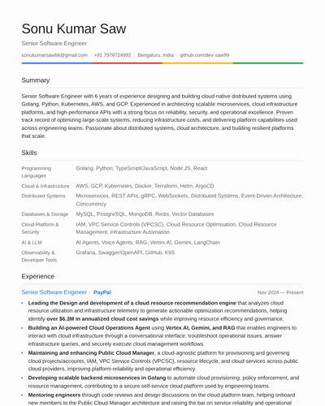</a><br><sub><b>Google</b></sub></td>
    <td align="center" width="33%"><a href="screenshots/anthropic.png">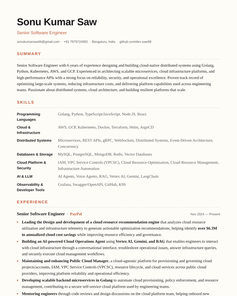</a><br><sub><b>Anthropic</b></sub></td>
    <td align="center" width="33%"><a href="screenshots/openai.png">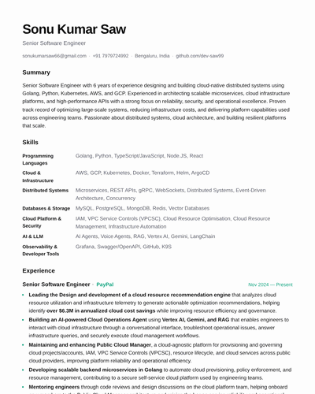</a><br><sub><b>OpenAI</b></sub></td>
  </tr>
  <tr>
    <td align="center" width="33%"><a href="screenshots/netflix.png">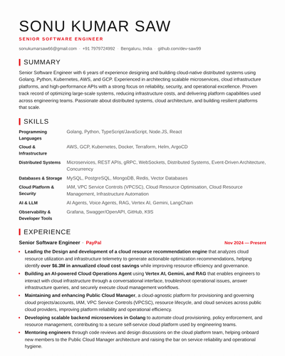</a><br><sub><b>Netflix</b></sub></td>
    <td align="center" width="33%"><a href="screenshots/meta.png">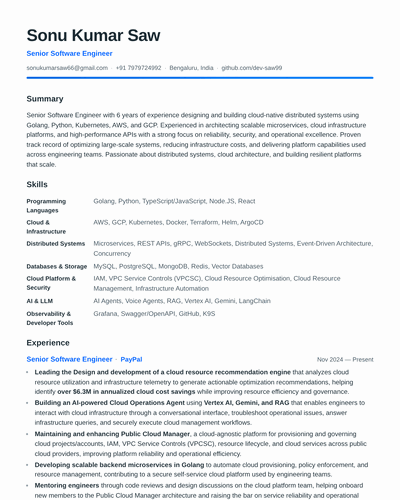</a><br><sub><b>Meta</b></sub></td>
    <td align="center" width="33%"><a href="screenshots/xai.png">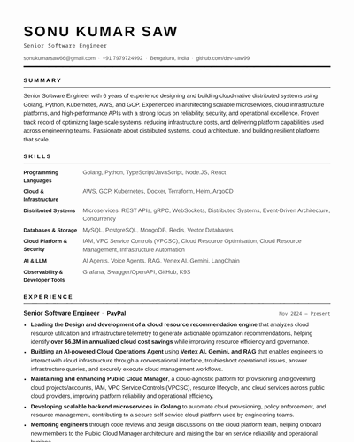</a><br><sub><b>xAI</b></sub></td>
  </tr>
</table>

### Two column (9)

Skills, education and languages in a sidebar. Eclipse and Twilight are dark.

<table>
  <tr>
    <td align="center" width="33%"><a href="screenshots/atlas.png">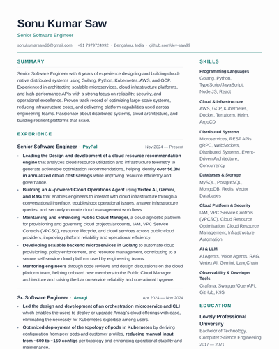</a><br><sub><b>Atlas</b></sub></td>
    <td align="center" width="33%"><a href="screenshots/ocean.png">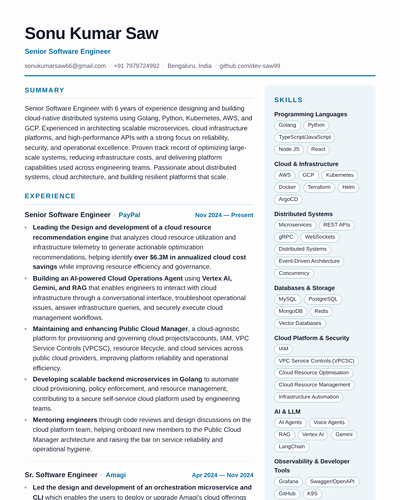</a><br><sub><b>Ocean</b></sub></td>
    <td align="center" width="33%"><a href="screenshots/slate.png">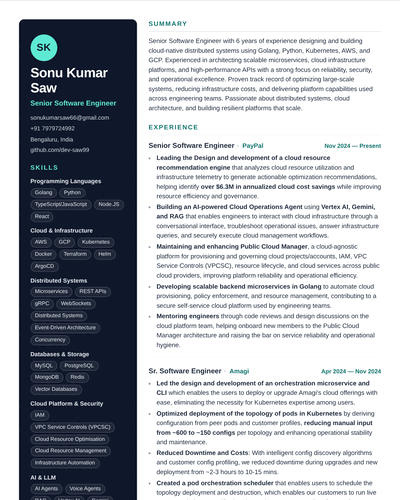</a><br><sub><b>Slate</b></sub></td>
  </tr>
  <tr>
    <td align="center" width="33%"><a href="screenshots/nordic.png">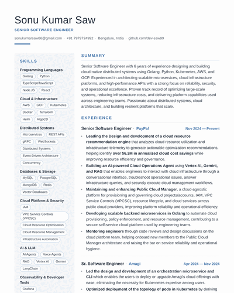</a><br><sub><b>Nordic</b></sub></td>
    <td align="center" width="33%"><a href="screenshots/indigo.png">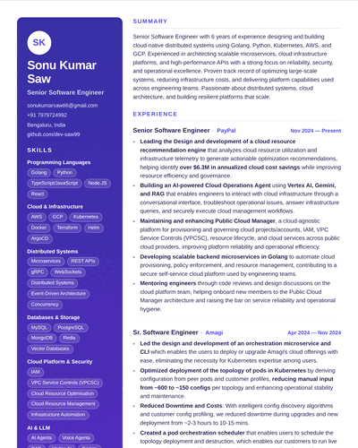</a><br><sub><b>Indigo</b></sub></td>
    <td align="center" width="33%"><a href="screenshots/coral.png">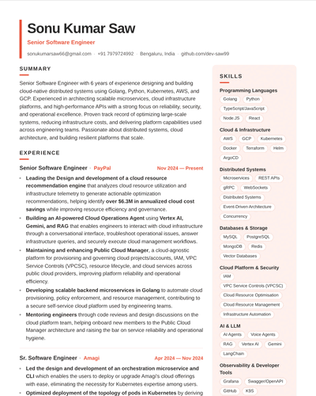</a><br><sub><b>Coral</b></sub></td>
  </tr>
  <tr>
    <td align="center" width="33%"><a href="screenshots/parchment.png">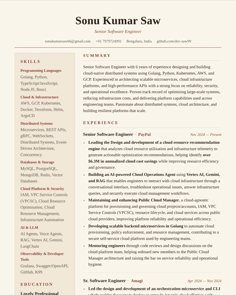</a><br><sub><b>Parchment</b></sub></td>
    <td align="center" width="33%"><a href="screenshots/eclipse.png">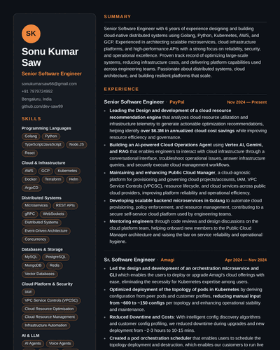</a><br><sub><b>Eclipse</b></sub></td>
    <td align="center" width="33%"><a href="screenshots/twilight.png">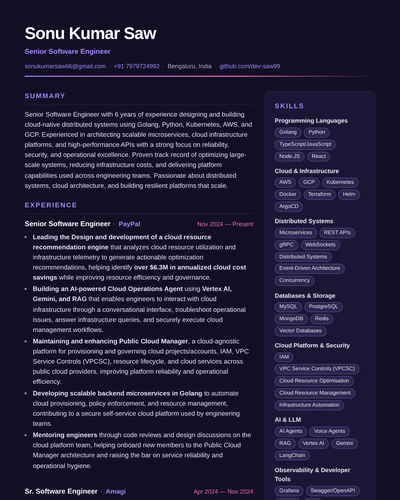</a><br><sub><b>Twilight</b></sub></td>
  </tr>
</table>

### Graphical (8)

Shapes, gradients and bold layouts for design-minded roles.

<table>
  <tr>
    <td align="center" width="25%"><a href="screenshots/banner.png">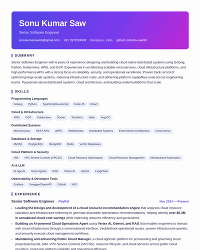</a><br><sub><b>Banner</b></sub></td>
    <td align="center" width="25%"><a href="screenshots/timeline.png">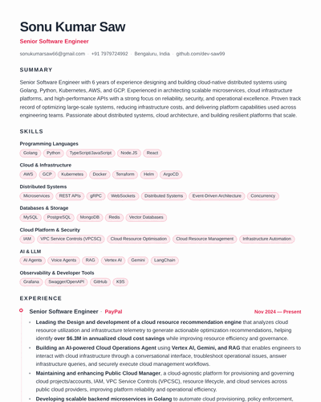</a><br><sub><b>Timeline</b></sub></td>
    <td align="center" width="25%"><a href="screenshots/sunset.png">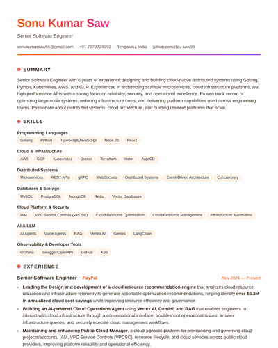</a><br><sub><b>Sunset</b></sub></td>
    <td align="center" width="25%"><a href="screenshots/aurora.png">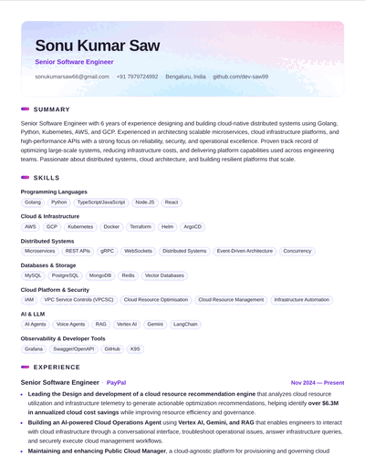</a><br><sub><b>Aurora</b></sub></td>
  </tr>
  <tr>
    <td align="center" width="25%"><a href="screenshots/cards.png">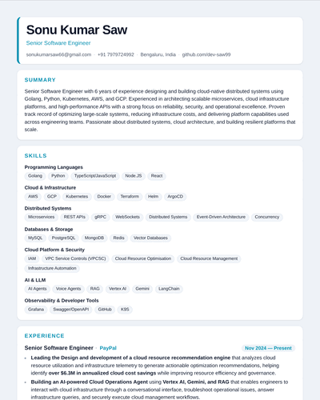</a><br><sub><b>Cards</b></sub></td>
    <td align="center" width="25%"><a href="screenshots/bauhaus.png">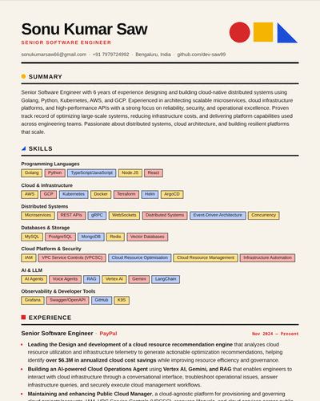</a><br><sub><b>Bauhaus</b></sub></td>
    <td align="center" width="25%"><a href="screenshots/brutalist.png">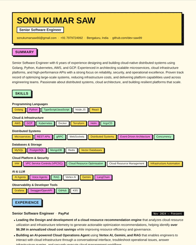</a><br><sub><b>Brutalist</b></sub></td>
    <td align="center" width="25%"><a href="screenshots/blueprint.png">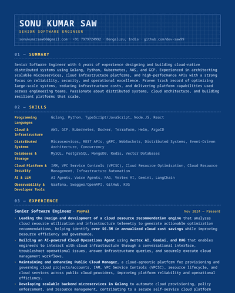</a><br><sub><b>Blueprint</b></sub></td>
  </tr>
</table>

### Dark (6)

Backgrounds are printed into the PDF.

<table>
  <tr>
    <td align="center" width="33%"><a href="screenshots/midnight.png">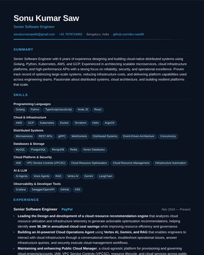</a><br><sub><b>Midnight</b></sub></td>
    <td align="center" width="33%"><a href="screenshots/terminal.png">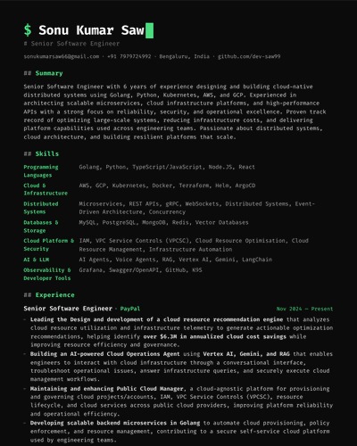</a><br><sub><b>Terminal</b></sub></td>
    <td align="center" width="33%"><a href="screenshots/dracula.png">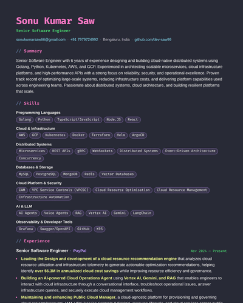</a><br><sub><b>Dracula</b></sub></td>
  </tr>
  <tr>
    <td align="center" width="33%"><a href="screenshots/obsidian.png">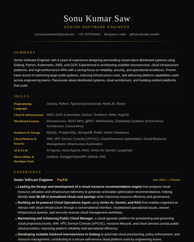</a><br><sub><b>Obsidian</b></sub></td>
    <td align="center" width="33%"><a href="screenshots/synthwave.png">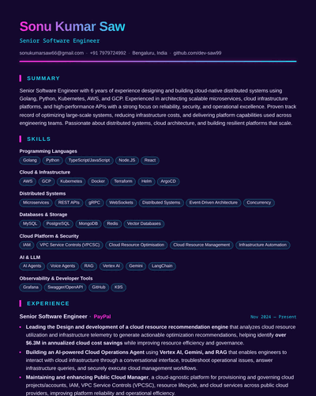</a><br><sub><b>Synthwave</b></sub></td>
    <td align="center" width="33%"><a href="screenshots/forest.png">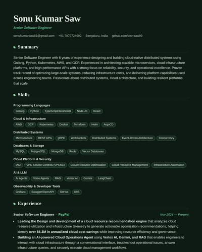</a><br><sub><b>Forest</b></sub></td>
  </tr>
</table>

## Exporting a PDF

PDFs are rendered by the project itself, not your browser's print dialog. A headless Chrome we control prints a dedicated chrome-free view (`/?print=1`) with a fixed paper size, no headers or footers, backgrounds included, and tagged text with bookmarks, so the output is the same for everyone.

```bash
npm run pdf -- data/me.json --theme slate --paper a4 --margin normal   # writes data/me.pdf
```

The **Download PDF** button uses the same renderer. Long jobs and projects flow across pages instead of leaving gaps; each bullet and short section stays whole.

<details>
<summary>Requirements and fallback</summary>

- Chrome or Chromium installed on the machine. `puppeteer-core` does not download one; set `CHROME_PATH=/path/to/chrome` if it is not on your `PATH`.
- Internet access for Google Fonts while rendering. Offline, the PDF falls back to system fonts.
- Without a local Chrome, the button falls back to the browser print dialog.

</details>

## The resume JSON

Everything is optional except `basics`.

```json
{
  "$schema": "./resume.schema.json",
  "basics": { "name": "Ada Lovelace", "label": "Engineer", "email": "ada@example.com" },
  "summary": "…",
  "skills": [{ "name": "Languages", "keywords": ["Go", "Python"] }],
  "experience": [{ "company": "…", "position": "…", "startDate": "2022-04", "highlights": ["…"] }]
}
```

Dates are `"YYYY"` or `"YYYY-MM"`; omit `endDate` for a current role. Reorder or hide sections with `meta.sectionOrder` and `meta.hiddenSections`.

<details>
<summary>All sections and the JSON Schema</summary>

Supported sections: `summary`, `experience`, `skills`, `projects`, `education`, `certifications`, `achievements`, `awards`, `publications`, `openSource`, `languages`, `interests`.

[`resume.schema.json`](resume.schema.json) describes every field (types, required keys, descriptions). Point your resume at it and editors such as VS Code and JetBrains give autocompletion and inline validation. The file is generated from the Zod schema, so never edit it by hand: run `npm run schema:generate` after changing `packages/schema/src/index.ts`.

A complete, real example lives in [`examples/sonu.json`](examples/sonu.json).

</details>

## Development

```bash
npm run dev                          # editor app (RESUME_FILE=… to load your own resume)
npm run build                        # production build
npm run typecheck                    # tsc across the whole monorepo
npm run validate -- data/me.json     # validate a resume file
npm run pdf -- data/me.json --theme slate   # render a resume straight to PDF
npm run schema:generate              # regenerate resume.schema.json from the Zod schema
```

<details>
<summary>Monorepo layout</summary>

| Path | Purpose |
| --- | --- |
| `packages/schema` | Zod schema (source of truth), TypeScript types, `validateResume`, JSON Schema and validate scripts |
| `packages/ui` | Theme contract (`Theme`, `DesignTokens`), typed section components, base CSS |
| `packages/renderer` | `<ResumeRenderer data={...} theme={...} />` |
| `packages/themes` | All 29 themes, per-theme CSS and the registry |
| `packages/pdf` | Paper sizes and margins, the headless-Chrome PDF renderer and `npm run pdf` CLI, plus the browser-print fallback |
| `apps/web` | Vite + React 19 + Tailwind v4 + Zustand editor app |
| `examples/` | Example resume JSON |
| `docs/` | [Using Resume Builder with AI](docs/using-ai.md) |
| `data/` | Git-ignored: your personal resumes |

</details>

<details>
<summary>Writing a theme</summary>

A theme is design tokens plus a full set of section components. Spread the defaults and override only what you need:

```tsx
import { defaultComponents, type Theme } from "@resume/ui";

export const myTheme: Theme = {
  id: "my-theme",
  name: "My Theme",
  className: "theme-my-theme",
  tokens: { /* colors, fonts, type scale, spacing */ },
  components: { ...defaultComponents, Header: MyHeader },
};
```

- Set `sidebar` to move sections into a second column, `sidebarPosition: "left"` to put it on the left, and `headerInSidebar: true` to render the header at the top of the sidebar (see `slate.tsx`).
- Tokens become `--rb-*` CSS variables on the resume root; the base stylesheet in `@resume/ui` consumes them. Per-theme CSS is scoped under `.theme-<id>` in `packages/themes/src/styles.css`.
- Register the theme in `packages/themes/src/index.ts`. Themes never read resume data directly, and the renderer needs no changes.

Coding agents: see [`AGENTS.md`](AGENTS.md) for the full checklist, including screenshots for the gallery.

</details>

## Roadmap

- [x] JSON schema, renderer and theme API
- [x] 29 themes: single-column, two-column, graphical and dark
- [x] Live editor with validation, theme sidebar and light/dark UI
- [x] Own PDF renderer (headless Chrome) and CLI
- [x] AI workflows: agent guide, chat prompts, job-description tailoring
- [ ] Keyword-gap report: compare a resume against a job description from the CLI
- [ ] ATS-style scoring and a plain-text export
- [ ] Repeating sidebars on multi-page two-column themes

## License

[MIT](LICENSE)
